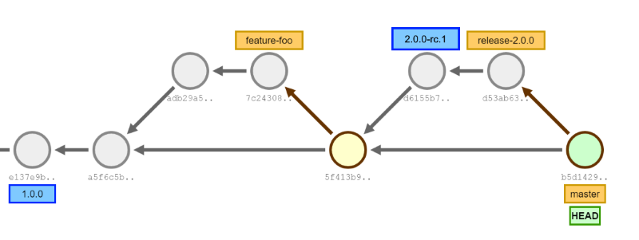

At each commit sha GitVersion will calculate:

```shell
e137e9 -> 1.0.0+0
a5f6c5 -> 1.0.1+1
adb29a -> 1.0.1-feature-foo.1+1 (PR #5 Version: `1.0.1-PullRequest.5+2`)
7c2438 -> 1.0.1-feature-foo.1+2 (PR #5 Version: `1.0.1-PullRequest.5+3`)
5f413b -> 1.0.1+4
d6155b -> 2.0.0-rc.1+0 (Before and after tag)
d53ab6 -> 2.0.0-rc.2+1 (Pre-release number was bumped because of the tag on previous commit)
b5d142 -> 2.0.0+0 (2.0.0 branch was merged, so master is now at 2.0.0)
```

This is just a small sample of the way GitVersion works. The idea is you just
plug it in and you will get sensible version numbers by default. We support the
following branch types ootb:

- master
- develop
- hotfix/
- feature/
- pull requests (stash, github and a few others)
- support/
- release/

If you have other branch types GitVersion is entirely configuration driven, so
check out the [Configuration](configuration.md) section of the readme to
understand how to make GitVersion work for you.

## GitFlow

[See GitFlow Examples](git-branching-strategies/gitflow-examples.md)

## GitHubFlow

[See GitHubFlow Examples](git-branching-strategies/githubflow-examples.md)
